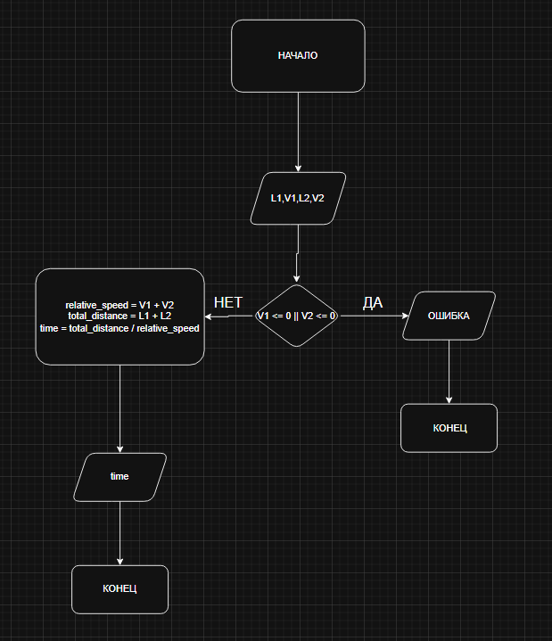

# Домашнее задание к работе 2

## Условие задачи
Два поезда длиной L1 и L2 движутся со скоростями V1 и V2 навстречу друг другу. Определить продолжительность их прохождения один против другого.

## 1. Алгоритм и блок-схема

### Алгоритм
1. **Начало**
2. Задать исходные данные:
   - `L1` — Задаем длину первого поезда.
   - `L2` — Задаем длину второго поезда.
   - `V1` — Задаем скорость первого поезда.
   - `V2` — Задаем скорость второго поезда.
3. Вычисляем относительную скорость:
   - `relative_speed` = `V1` + `V2` 
4. Вычисляем общее расстояние, которое нужно пройти поездам друг относительно друга:
   - `total_distance` = `L1` + `L2`
5. Вычисляем время встречи:   
   - `time` = `total_distance` / `relative_speed`
6. Вывести результаты расчетов с подстановкой всех значений в текст.
7. **Конец**

### Блок-схема



## 2. Реализация программы

```C
#include <stdio.h>
#include<locale.h>
int main() {
    setlocale(LC_ALL, "RUS");
    double L1, L2, V1, V2;


    printf("Введите длину первого поезда (L1): ");
    scanf_s("%lf", &L1);

    printf("Введите скорость первого поезда (V1): ");
    scanf_s("%lf", &V1);

    printf("Введите длину второго поезда (L2): ");
    scanf_s("%lf", &L2);

    printf("Введите скорость второго поезда (V2): ");
    scanf_s("%lf", &V2);


    if (V1 <= 0 || V2 <= 0) {
        printf("Ошибка: скорости должны быть положительными.\n");
        return 1;
    }

    // Вычисляем относительную скорость
    double relative_speed = V1 + V2;

    // Вычисляем общее расстояние, которое нужно пройти поездам друг относительно друга
    double total_distance = L1 + L2;

    // Вычисляем время встречи
    double time = total_distance / relative_speed;


    printf("Время прохождения поездов друг против друга: %.2lf секунд\n", time);

    return 0;
}
```

## 3. Результаты работы программы

Введите длину первого поезда (L1): 4
Введите скорость первого поезда (V1): 5
Введите длину второго поезда (L2): 5
Введите скорость второго поезда (V2): 4
Время прохождения поездов друг против друга: 1,00 секунд

C:\Users\ryzhk\source\repos\DZrab2rab3\x64\Debug\DZrab2.exe (процесс 23996) завершил работу с кодом 0 (0x0).

## 4. Информация о разработчике

Рыжков Сергей. бИЦ-252 Вариант 18
